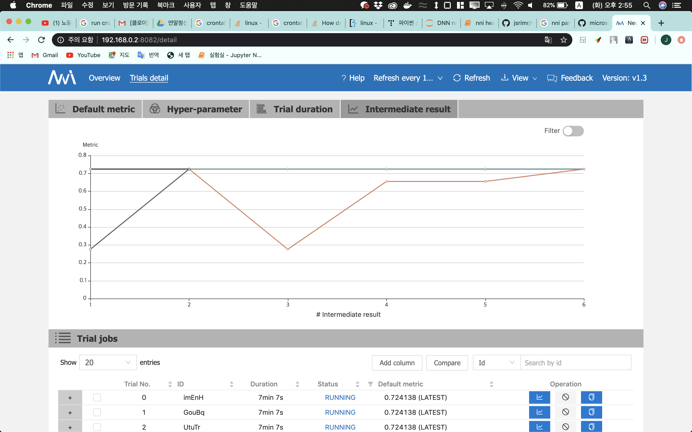

# HOW TO USE
```
config.yml 파일 작성
-> 일단 돌리는게 목표인 경우는 python interpreter 경로만 신경 써주면 됨

search_space.json 파일작성
-> hyperparameter search_space 정의

```
그리고 실행.
```
nnictl create --config config.yml --port 8082
```

- 결과
